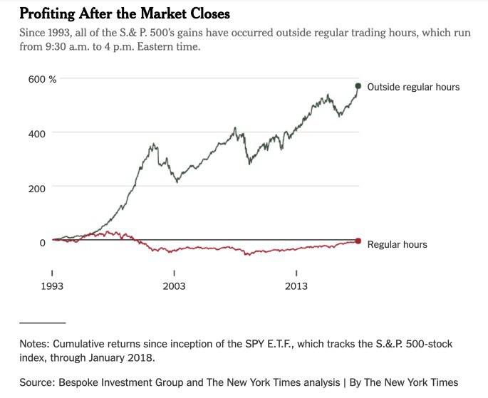
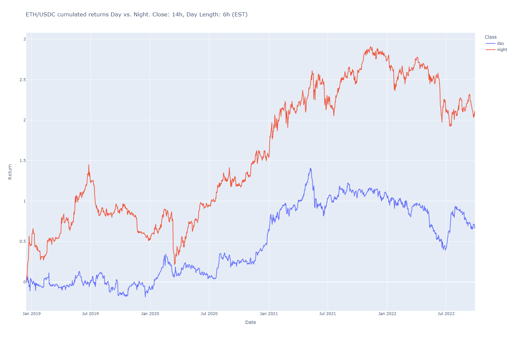
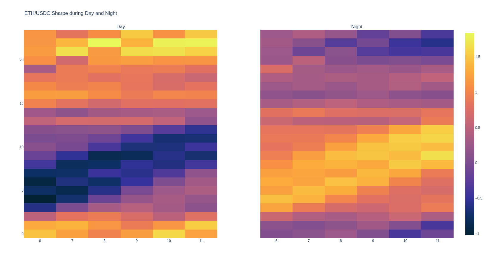
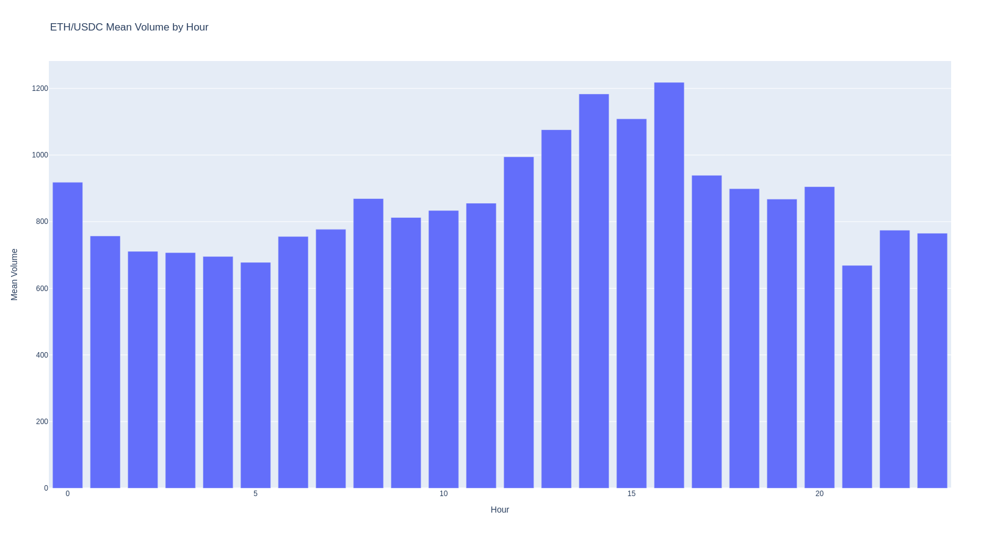

# CIRCADIAN EFFECT ON ETH/USDC

Original motivation comes from this analysis on the american stock index SP500:

> All the SP500's gains have occured outside regular trading hours (i.e. from Close to Open)

When running some analysis on the ETH/USDC pair, we find this breakdown of returns (day vs. night):

But no real stability can be demonstrated. When looking at sharpe ratios, day vs. night, for various combinations of closing and opening hours, we find this:

Mean volume of traded ETH by hour of day:

