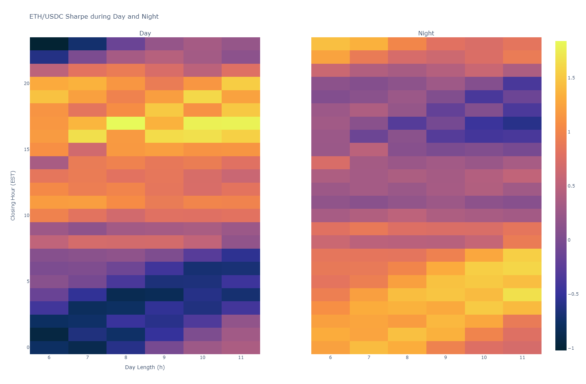
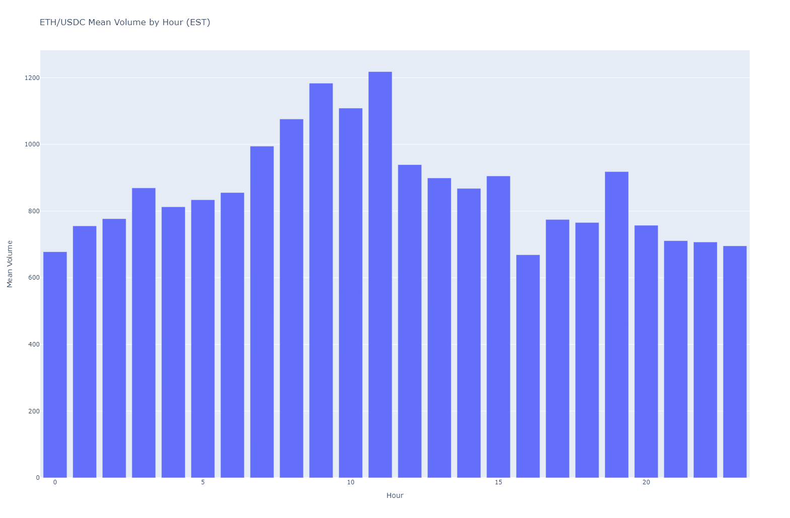

# CIRCADIAN EFFECT ON ETH/USDC

Original motivation comes from this analysis on the american stock index SP500:

> All the SP500's gains have occured outside regular trading hours (i.e. from Close to Open)

When running some analysis on the ETH/USDC pair, we find the opposite
(performing from open to close, steady from close to open). Keep in mind that
timezone is EST.

But no real stability can be demonstrated. Let's look at sharpe ratios, day
vs. night, for various combinations of closing and opening hours:

For a slightly different combination of closing hour (14h) and day length (6h),
we find a more mitigated result. Some dynamics at open and close may explain
this. 

Another interesting view : Mean volume of traded ETH by hour of day (EST). We
find a peek of activity at open (between 9am and 11am). Interestingly, the
bottom of activity is at closing time (4pm).

